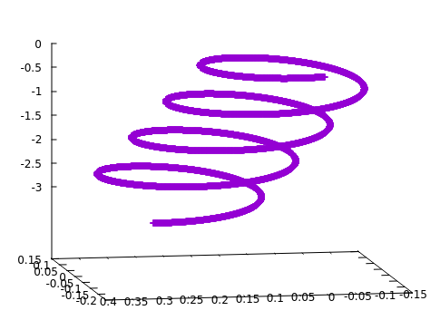

# `Path of a Particle`
---


An implementation of an integrator for a particle. The main purpose of this is to show the path of the particle based on its force. It has the option to show the path using an Euler integration algorithm, or the more accurate integration algorithm: Verlet. The force function can be changed, and so can the initial conditions to map any particle's motion.

This code was based off of GitHub user TimTro's livecode-projectile repository. This can be found [here](https://github.com/timtro/livecode-projectile)


## UNIX Compilation

Compile with
```bash
clang++ -std=c++14 -o projectile projectile.cpp
```
or
```bash
g++ -std=c++14 -o projectile projectile.cpp
```
and run as
```bash
./projectile <algorithm>

Options:
<algorithm> : enter -v for Verlet, or -e for Euler
```
and watch your terminal fill with numbers.

## Output

The output will be six columns of numbers with the following order:
```
time [s], x-position [m], y-position [m], x-speed [m/s], y-speed [m/s]
```

You can also insert this into a text file by

```bash
./projectile <algorithm> > projectile.dat
```

From there you can insert it into gnuplot as follows

```bash
$ gnuplot
gnuplot> splot 'projecile.dat' u 2:3:4
```

This tells gnuplot to use the 2-4th columns, so that you are plotting the function of the position only.

If you were to plot this function you should get something similar to this


## Question 2

The trajectory produced by the Verlet algorithm differs from the Euler integrator, due to the Verlet algorithm
accounts for acceleration. What this produces is a more accurate model that represents the function better, as it will account
for a change in velocity that can occur during the change in time. Depending on the equation for the force, it can differ a little, or a lot. In this case, it does not differ much, but in other cases it may be a whole lot.

## Question 3

The type-constructor VecR2<int> constitutes a vector space due to being able to define vector addition, in conjunction to "scaled" multiplication, and there is a zero vector e in the vector space.

Vector addition is defined as being able to add components of Vector1 (a,b) to components of Vector2 (c,d). What this produces is Vector3 whose components are (a+c , b+d). For this to work the corresponding components (a & c) & (b & d) must be of the same type, which in our case is type int. Therefore there is closure under addition.

"Scaled" multiplication is simply being able to multiply a vector by something and produce a true result. By defining our multiplication ```a*Vect(b,c) = Vect(a*b , a*c)```, we have created a space where all vectors multiplied by an object equals a vector whose individual components are multiplied by that same object, where the vector's components in our case are integers. Therefore there is closure under multiplication.

Lastly, there must be a zero vector where ```Vect(a,b) + e = Vect(a,b)```. In this case the e is equal to Vect(0,0) since 0 is an integer, and ```Vect(a,b) + Vect(0,0) = Vect(a + 0, b + 0) = Vect(a,b)```

Therefore we can conculde that the type VecR2<int> is a vector space.

## Question 4

The type equation: L<T> = 1 + T x L<T>

Provides an algorithm for construction of a list of types. Where L is a function of T that returns either: empty, a single type, 2 types, 3 types, and so forth.
